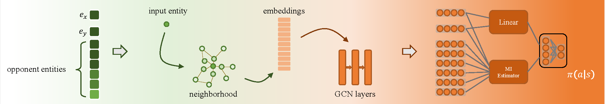

# Deep Reinforcement Learning for Entity Alignment


This repository is the official implementation of [Deep Reinforcement Learning for Entity Alignment](https://openreview.net/pdf?id=CRBzhRdkycU), *Findings of ACL 2022*. 

<p align="left">
    
</p>


## Requirements

Please first download the dataset from [OpenEA](https://github.com/nju-websoft/OpenEA), and then install gym and required packages of OpenEA:

```bash
conda create -n openea python=3.6
conda activate openea
conda install tensorflow-gpu==1.8
conda install -c conda-forge graph-tool==2.29
conda install -c conda-forge python-igraph
pip install -r requirement.txt
pip install gym
```

## Training & Evaluation

Use the following scripts to run RLEA with RDGCN as basic EEA model on D-Y:

```bash
cd run
python runRLEA.py --model_name rdgcn --dataset D_Y
```

If run with the stored embeddings:

```bash
python runRLEA.py --model_name rdgcn --dataset D_Y --restore_embeddings True
```

For SEA which has projection matrices:

```bash
python runRLEA.py --model_name sea --dataset D_Y --mapping True
```

Available EEA models: JAPE, SEA, RSN, RDGCN, AlignE, BootEA. 

The corresponding model names: jape, sea, rsn, rdgcn, aligne, bootea.

Available datasets: EN_FR, EN_DE, D_W, D_Y

## Results

Our model achieves the following performance on OpenEA V1 benchmarks:

<p align="left">
    
</p>


## How to Cite

If you use or extend our work, please cite the following paper:

```
@inproceedings{RLEA,
    title = "Deep Reinforcement Learning for Entity Alignment",
    author ="Lingbing Guo and
            Yuqiang Han and
            Qiang Zhang and
            Huajun Chen",
    booktitle = "Findings of ACL 2022",
    url = "https://openreview.net/pdf?id=CRBzhRdkycU",
}
```


## Contributing

This project is licensed under the MIT License. Any contribution is welcomed and appreciated.
