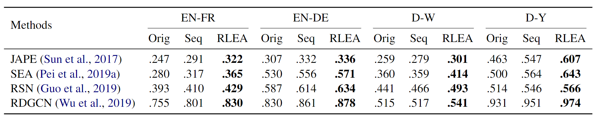

[**中文**](https://github.com/guolingbing/RLEA/blob/main/README_CN.md) | [**English**](https://github.com/guolingbing/RLEA)


<p align="center">
    
</p>

<p align="center">
    <strong一种基于强化学习的实体对齐方法</strong>
</p>


# Deep Reinforcement Learning for Entity Alignment

这里是[Deep Reinforcement Learning for Entity Alignment](https://openreview.net/pdf?id=Bi4BpAAqx0)的官方实现代码。


## 作者
郭凌冰，韩玉强，张强，陈华钧。


## 环境要求

需要按以下命令去配置项目运行环境：

下载[OpenEA](https://github.com/nju-websoft/OpenEA)数据集并安装相关依赖：

```bash
conda create -n openea python=3.6
conda activate openea
conda install tensorflow-gpu==1.8
conda install -c conda-forge graph-tool==2.29
conda install -c conda-forge python-igraph
pip install -r requirement.txt
pip install gym
```

## 运行和评估

请运行以下命令来训练项目模型：

使用以下命令以RDGCN为基本模型运行RLEA在D-Y数据集上：


```bash
cd run
python runRLEA.py --model_name rdgcn --dataset D_Y
```

如果需要加载已经训练好的模型，则使用以下命令：

```bash
python runRLEA.py --model_name rdgcn --dataset D_Y --restore_embeddings True
```

如果使用SEA作为基础模型，则需要指明使用投影矩阵：

```bash
python runRLEA.py --model_name sea --dataset D_Y --mapping True
```

可用模型列表：JAPE, SEA, RSN, RDGCN, AlignE, BootEA。

对应模型参数名称：jape, sea, rsn, rdgcn, aligne, bootea。

可用数据集名称：EN_FR, EN_DE, D_W, D_Y。


## 结果

我们的模型在OpenEA数据集上达到了以下性能：

<p align="left">
    
</p>

## 有关论文

如果您使用或拓展我们的工作，请引用以下论文：

```
@inproceedings{RLEA,
    title = "Deep Reinforcement Learning for Entity Alignment",
    author ="Lingbing Guo and
            Yuqiang Han and
            Qiang Zhang and
            Huajun Chen",
    booktitle = "Findings of ACL 2022",
    url = "https://openreview.net/pdf?id=Bi4BpAAqx0",
}
```

This project is licensed under the MIT License. Any contributions to the project are always very welcome.


